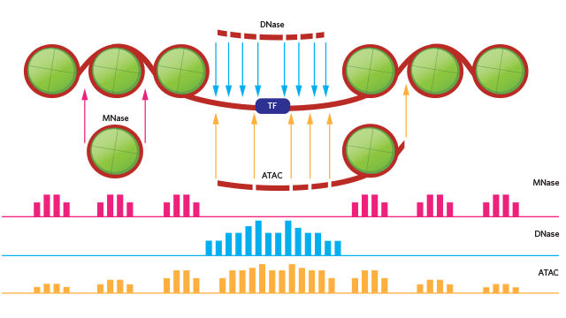
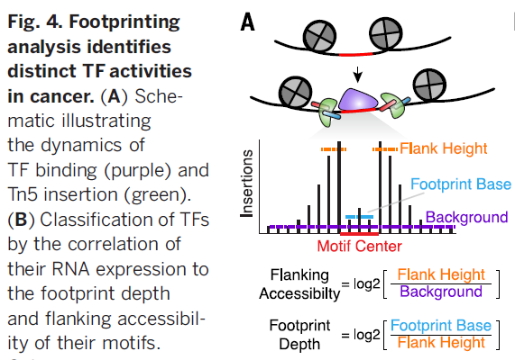

## cfDNA
Scripts and documents for circulating cell-free DNA data analysis

## Tutorial
https://qiubio.com/new/book/chapter-06/#%E7%AC%AC%E4%BA%94%E7%AB%A0-atac-seq%E6%95%B0%E6%8D%AE%E5%88%86%E6%9E%90chapter-5-atac-seq-data-analysis

## Signal detection/statistics
1. Normalized coverage depth of each position
2. WPS (Windowed Protection Score). [script](https://github.com/shendurelab/cfDNA/blob/master/extractReadStartsFromBAM2Wig.py)

### peak calling software
https://github.com/taoliu/MACS
https://sites.google.com/site/danposdoc/

### ATAC-seq peak calling
https://yiweiniu.github.io/blog/2019/03/ATAC-seq-data-analysis-from-FASTQ-to-peaks/

## Chromatin Structure Research Methods (MNase DNase ATAC)
* [link](https://www.labome.com/method/Chromatin-Structure-Research-Methods.html)        
         

## ilustrate WHY there is a gap in the coverage of TF binding site
* [link](https://www.biostars.org/p/347703/)     
  

## tools for gene expression
* [GEPIA](http://gepia.cancer-pku.cn/detail.php?gene=DNASE1L3)

